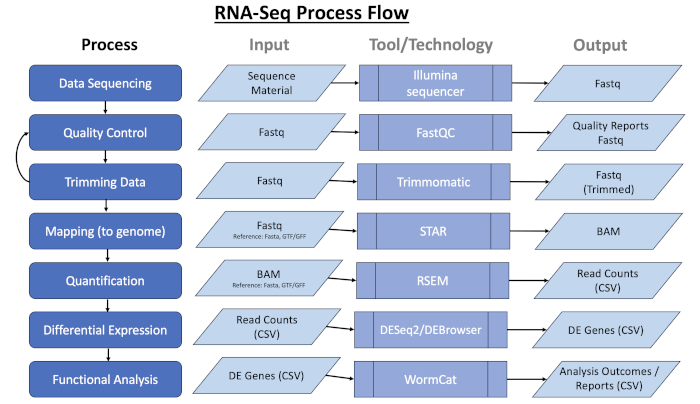

# RNA-Seq Pipeline Overview
    
### 
Analysis for Francis lab

* __Prepared for__: 

	* Mike Francis (michael.francis@umassmed.edu) 
	* Kasturi Biswas (kasturi.biswas@umassmed.edu) 

* __Prepared by__ : Dan Higgins (daniel.higgins@umassmed.edu)

* __Process Executed on__ : Dec-13-2023

 

--- 
### Data Access
* __Dropbox Folder__: Francis lab_KB_wholeworm RNAseq data_March 2023_Share AW lab/PQ_treatment_and_control_November_experiment_2023
* __Dropbox URL__: [https://www.dropbox.com/scl/fo/e8eldk0yrvs56g0d5sr54/h?rlkey=681znxai9mpm834n4a2v2hqlu&dl=0](https://www.dropbox.com/scl/fo/e8eldk0yrvs56g0d5sr54/h?rlkey=681znxai9mpm834n4a2v2hqlu&dl=0)

 

#### FASTQ files

<pre class="source-code">

  1.687Gi 2023-11-30 07:51:00 PQ_2_day_N2/PQ_N2_set1_102223_harvest/PQ_N2_set1_1.fq.gz
  1.716Gi 2023-11-30 07:51:00 PQ_2_day_N2/PQ_N2_set1_102223_harvest/PQ_N2_set1_2.fq.gz
  2.202Gi 2023-11-30 07:52:00 control_N2/Control_N2_set1_102223_harvest/Con_N2_set1_1.fq.gz
  2.261Gi 2023-11-30 07:52:00 control_N2/Control_N2_set1_102223_harvest/Con_N2_set1_2.fq.gz
  2.814Gi 2023-11-30 07:51:00 PQ_2_day_N2/PQ_N2_set2_110623_harvest/PQ_N2_set2_1.fq.gz
  2.967Gi 2023-11-30 07:51:00 PQ_2_day_N2/PQ_N2_set2_110623_harvest/PQ_N2_set2_2.fq.gz
  2.411Gi 2023-11-30 07:52:00 control_N2/Control_N2_set2_110623_harvest/Con_N2_set2_1.fq.gz
  2.517Gi 2023-11-30 07:52:00 control_N2/Control_N2_set2_110623_harvest/Con_N2_set2_2.fq.gz

</pre>

 

#### Gene Index files

Gene Index based on Wormbase Version: _WS289_

--- 

### RNA Seq Process

### Pipeline Outputs

* MD5 Checksum Report
* FAST QC Report
* Multi QC Report
* Isoform Quantification
* Gene Quantification
* DESeq2 Gene Normalizations (Up, Down, All Expressed) & Visualizations
* WormCat Annotations and Visualizations of gene set enrichment data

### Source Code

The provided tagged repository is available to create reproducible outputs from the RNA-Seq Pipeline.

<table>
<tr><td><b>Config</b></td><td><a href="https://github.com/DanH-UMassMed/Francis_Lab">https://github.com/DanH-UMassMed/Francis_Lab</a></td></tr>
<tr><td><b>Pipeline</b></td><td><a href="https://github.com/DanH-UMassMed/RNA-Seq-Nextflow">https://github.com/DanH-UMassMed/RNA-Seq-Nextflow</a> -r v1.0.7</td></tr>
</table>

